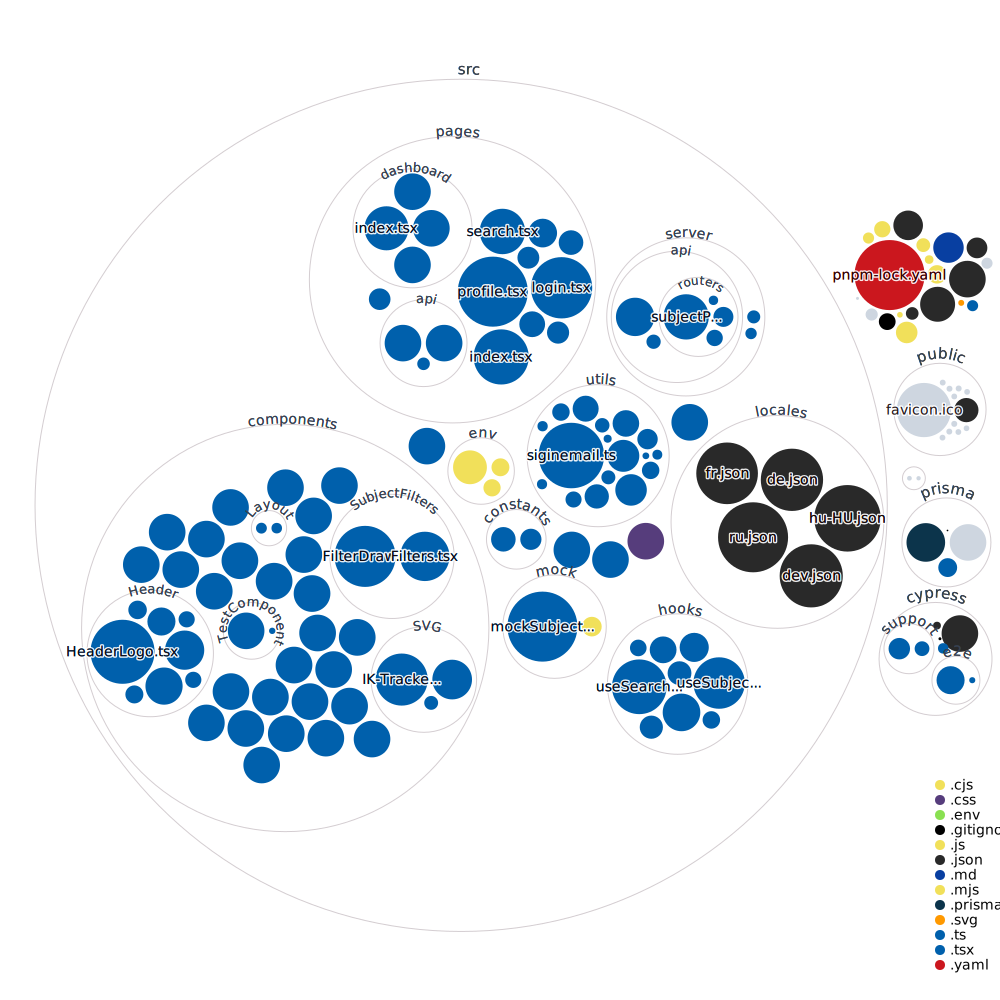

# Create T3 App

This is a [T3 Stack](https://create.t3.gg/) project bootstrapped with `create-t3-app`.

## What's next? How do I make an app with this?

We try to keep this project as simple as possible, so you can start with just the scaffolding we set up for you, and add additional things later when they become necessary.

If you are not familiar with the different technologies used in this project, please refer to the respective docs. If you still are in the wind, please join our [Discord](https://t3.gg/discord) and ask for help

- [Next.js](https://nextjs.org)
- [NextAuth.js](https://next-auth.js.org)
- [Prisma](https://prisma.io)
- [Tailwind CSS](https://tailwindcss.com)
- [tRPC](https://trpc.io)

## Learn More

To learn more about the [T3 Stack](https://create.t3.gg/), take a look at the following resources:

- [Documentation](https://create.t3.gg/)
- [Learn the T3 Stack](https://create.t3.gg/en/faq#what-learning-resources-are-currently-available) — Check out these awesome tutorials

You can check out the [create-t3-app GitHub repository](https://github.com/t3-oss/create-t3-app) — your feedback and contributions are welcome!

## How do I deploy this?

Follow our deployment guides for [Vercel](https://create.t3.gg/en/deployment/vercel), [Netlify](https://create.t3.gg/en/deployment/netlify) and [Docker](https://create.t3.gg/en/deployment/docker) for more information.

## Diagram



## Temp project structure

```bash
.
├── cypress
│  ├── e2e
│  │  ├── homePage.cy.ts
│  │  └── sreachPage.cy.ts
│  ├── fixtures
│  │  └── example.json
│  ├── support
│  │  ├── commands.ts
│  │  └── e2e.ts
│  ├── testIds.ts
│  └── tsconfig.json
├── prisma
│  ├── schema.prisma
│  └── seed.ts
├── public
├── src
│  ├── components
│  │  ├── Accordion
│  │  ├── AddMenu
│  │  ├── AssessmentTable
│  │  ├── Badge
│  │  ├── Breadcrumbs
│  │  ├── Button
│  │  ├── ClickAwayListener
│  │  ├── ComboBox
│  │  ├── ConfirmationDialog
│  │  ├── FilterDisclosure
│  │  ├── Header
│  │  │  ├── DarkModeToggle.tsx
│  │  │  ├── HamburgerMenuButton.tsx
│  │  │  ├── Header.tsx
│  │  │  ├── HeaderLink.tsx
│  │  │  ├── HeaderLogo.tsx
│  │  │  ├── LanguageToggleButton.tsx
│  │  │  ├── MobileMenu.tsx
│  │  │  └── NavLinks.tsx
│  │  ├── InputField
│  │  ├── Layout
│  │  │  ├── Layout.tsx
│  │  │  └── ScrollLayout.tsx
│  │  ├── LoadingStates
│  │  ├── MaintenanceMode
│  │  ├── MarkTable
│  │  ├── Pagination
│  │  ├── PlannerInputGroup
│  │  ├── ProgressCard
│  │  ├── SearchInput
│  │  ├── SortMenu
│  │  ├── Spinner
│  │  ├── StatisticsTable
│  │  ├── SubjectCard
│  │  ├── SubjectFilters
│  │  │  ├── FilterDrawer.tsx
│  │  │  └── Filters.tsx
│  │  ├── SubjectGrid
│  │  ├── SubjectList
│  │  ├── SubjectResultModal
│  │  ├── SubjectTable
│  │  └── SVG
│  │     ├── IK-TrackerLoading.tsx
│  │     ├── MacBookSVG.tsx
│  │     └── SortSVG.tsx
│  ├── constants
│  │  ├── filters.ts
│  │  └── pages.ts
│  ├── contexts
│  │  └── FeatureFlagContext.tsx
│  ├── env
│  │  ├── client.mjs
│  │  ├── schema.mjs
│  │  └── server.mjs
│  ├── hooks
│  │  ├── useIsFeatureflagEnabled.ts
│  │  ├── useIsSmallerThanBreakpoint.ts
│  │  ├── useMobileFullscreenHeight.ts
│  │  ├── useSearchPage.ts
│  │  ├── useSocket.ts
│  │  └── useThemeMode.ts
│  ├── i18n
│  │  └── i18n.ts
│  ├── locales
│  │  ├── dev.json
│  │  └── hu-HU.json
│  ├── mock
│  │  ├── mockSubjects.ts
│  │  └── transform.js
│  ├── pages
│  │  ├── api
│  │  │  ├── auth
│  │  │  │  └── [...nextauth].ts
│  │  │  └── trpc
│  │  │     └── [trpc].ts
│  │  ├── dashboard
│  │  │  ├── calculator
│  │  │  │  └── index.tsx
│  │  │  ├── planner
│  │  │  │  └── index.tsx
│  │  │  ├── progress
│  │  │  │  └── index.tsx
│  │  │  └── index.tsx
│  │  ├── 404.tsx
│  │  ├── 500.tsx
│  │  ├── _app.tsx
│  │  ├── _document.tsx
│  │  ├── index.tsx
│  │  ├── login.tsx
│  │  ├── profile.tsx
│  │  ├── search.tsx
│  │  └── verify-email.tsx
│  ├── schemas
│  │  └── subjectProgress-schema.ts
│  ├── server
│  │  ├── api
│  │  │  ├── routers
│  │  │  │  ├── assessment.ts
│  │  │  │  ├── subject.ts
│  │  │  │  ├── subjectProgress.ts
│  │  │  │  └── users.ts
│  │  │  ├── root.ts
│  │  │  └── trpc.ts
│  │  ├── auth.ts
│  │  └── db.ts
│  ├── styles
│  │  └── globals.css
│  ├── types
│  │  └── next-auth.d.ts
│  └── utils
│     ├── api.ts
│     ├── calculatePlannerStatistics.ts
│     ├── calculateResultStats.ts
│     ├── calculateStatistics.ts
│     ├── debounce.ts
│     ├── filterHelpers.ts
│     ├── getCurrentBreakpoint.ts
│     ├── getGradeColor.ts
│     ├── getResultTypeDisplay.ts
│     ├── loadLanguage.ts
│     ├── nullToZero.ts
│     ├── plannerHelperFunctions.tsx
│     └── subjectComparator.ts
├── cypress.config.ts
├── eipt.code-workspace
├── jest.config.cjs
├── lint-staged.config.cjs
├── next.config.mjs
├── package.json
├── pnpm-lock.yaml
├── postcss.config.cjs
├── prettier.config.cjs
├── project-structure.md
├── README.md
├── renovate.json
├── tailwind.config.cjs
├── tailwind.shared.config.cjs
└── tsconfig.json
```
